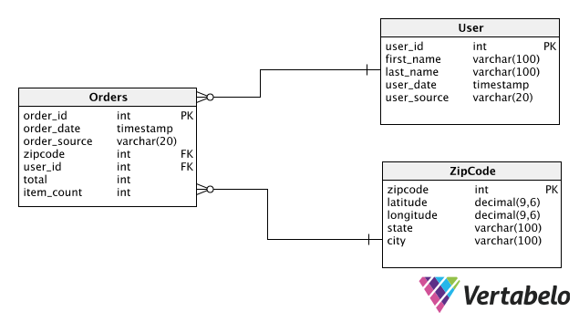

# smava
Smava DWH Challenge

### Exercise 1 – Theory
a. Name and shortly describe the three core entities of the raw layer of Data Vault 2.0.

- **Hub**:
  - Comprises a unique list of business keys
  - Generates an efficient surrogate key for each business key
- **Link**:
  - Represents an association of two or more hubs
  - Is always based on many-to-many relationships
- **Satellite**:
  - Captures hub or link descriptive attributes through time
  - Groups attributes according to subject area or mutation rate

b. Name and shortly describe two advance entities of Data Vault 2.0 that can be used to enhance
performance.

- **Hub**: Hubs are used for performance optimizations, as joining two tables on a single column is faster than joining on multiple.

- **Hash Functions**: Hashes can be used to generate a surrogate key value that is typically much smaller (and thus, “faster”, in particular for join operations).

### Excercise 2 - Design DWH using Data Vault
a. Design a physical ERD based on Data Vault 2.0 methodology.

[Orders DV SQL](sql/data_vault.sql)

b. Design a Star-Schema Data Mart ERD using your entities from the previous steps.

[Orders Star SQL](sql/star_schema.sql)

### Exercise 3 - Implementation and coding
a. Create PostgreSQL functions to load two different types of core entities of Data Vault 2.0 based on your design in Exercise 2.

> Although i would have preferred writing a script in Python, Ruby or Bash to insert data to these relational tables, here's some Postgres LOAD sentences for User (Satellite) and Order (HUB) tables.

  - [Postgres Load Script](sql/load.sql)
  
b. Create PostgreSQL function that accepts one text parameter and returns Boolean flag if the passed value is numeric or not.

> My solution uses a simple regex pattern matching

  - [Postgres Is Numeric Function](sql/is_numeric.sql)

c. Write a Python script that adds additional Geo information to the zip codes in the sample Order file.

>  My solution uses python csv module and urllib to make a request to the simple ZIP codes API, then append the details to the rows and write to a new file. The idea is to keep the script without external packages. I noticed that after passing the Free key threshold, staes show as Classified. I could get over this limitation by getting multiple keys, but that's overengineering for this task. A sample result file is [here](data/orders_with_location_details.py)

  - [Python Location Completion Script](fill_zip.py)